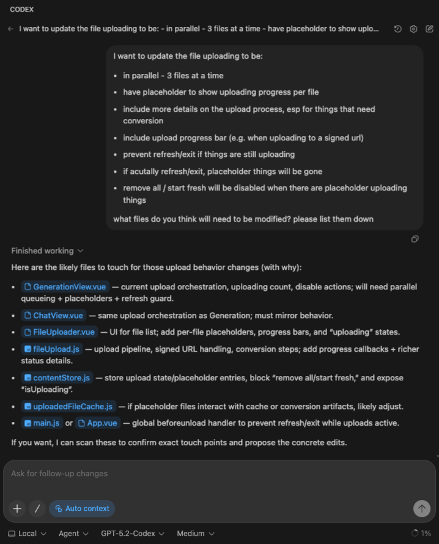
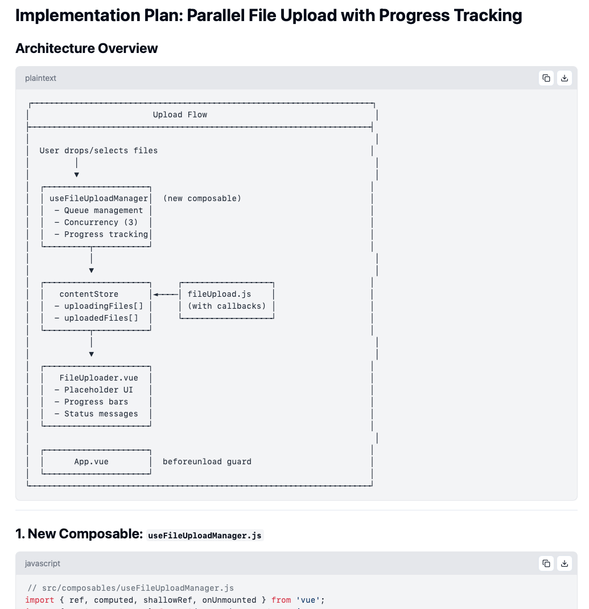
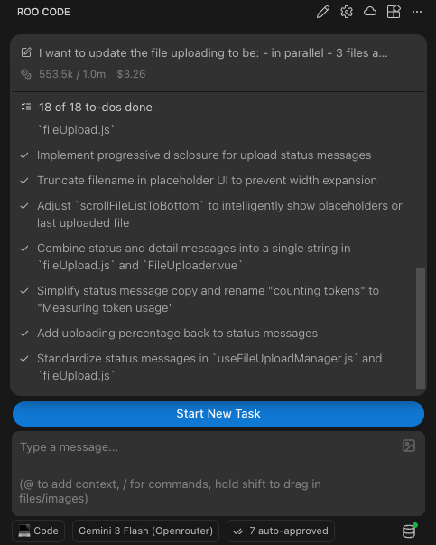
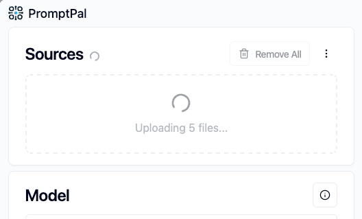
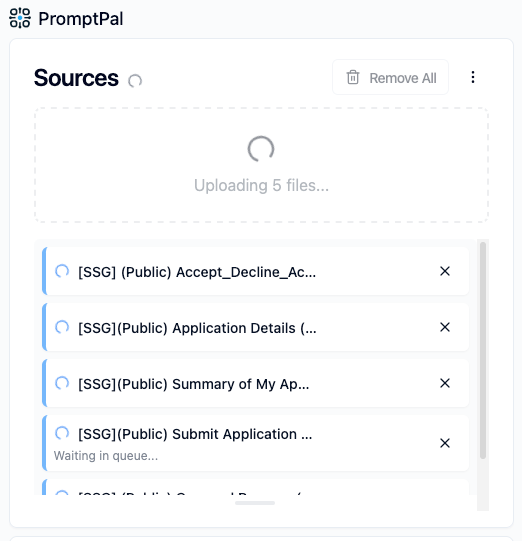
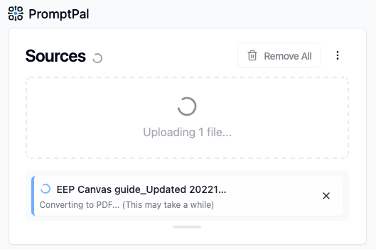

> *When you're building with AI coding assistants, the question isn't just "can it do the job?" - it's "can it do the job without costing me a small fortune?"*

Last month, I wrote about using different AI tools for survey analysis. This month, I'm back with another AI tools exploration, applied to an actual coding task: implementing parallel file uploads with progress tracking in PromptPal.

---

## What is PromptPal?

Before I dive in, a quick bit of context: **PromptPal** is an internal AI tool I built  at Ufinity. It lets employees work with project and customer data while staying compliant with our project contracts (data residency obligations). All data stays encrypted within Singapore and is deleted from servers after use.

Think of it as a secure, enterprise-grade interface for interacting with various LLMs,  and that's my codebase I'll be working on in this post.

---

## Why I can't just pick one model and stick with it

Before I get into the actual implementation, let me explain why I'm bothering to switch between tools in the first place. It all comes down to one thing many people might not realise about Large Language Models (LLMs): the longer the chat, the more [tokens](https://platform.openai.com/tokenizer) you're paying for - repeatedly. That is because LLMs have no memory, so every time you send a message, the entire conversation history gets sent back to the model.

> **FYI**: Tokens are how LLMs read text. Every word you type gets broken into these "chunks" for processing - roughly 4 characters per token, or about 75 words per 100 tokens.
>
> For example: `Entertaining` (1 word) → `Enter`-`t`-`aining` (3 tokens)

Think about that. Message 1 costs `X` tokens. Message 2 costs `X + Y` tokens (because it includes message 1). Message 15? It includes *everything* before it. The cost compounds with every message exchanged.

Now layer on the fact that different models have (drastically) different price tags:

| Model | Input Cost | Output Cost |
| :--- | :--- | :--- |
| Gemini 3 Flash | $0.50 / million tokens | $3.00 / million tokens |
| GPT 5.2 Codex | $1.75 / million tokens | $14.00 / million tokens |
| Claude 4.5 Opus | $5.00 / million tokens | $25.00 / million tokens |

Opus is **10x** more expensive than Flash on input. *Ten times.*

You may be wondering:

> ***"But I pay a flat monthly fee, so why should I care about token costs?"***

Fair question. If you're on GitHub Copilot ($10/month) or ChatGPT Plus ($20/month), you never see a per-token bill. But here's the thing: the provider still needs to pay per token, so they need to cap your usage somehow, or a handful of power users would bankrupt the service.

Hence, they allocate you a budget quota - usually measured in requests or tokens per time window - and when you hit it, you can't use the model anymore. This is why your Opus quota vanishes after a few back-and-forth exchanges, while Flash feels unlimited. The rate limit *is* the price - you're just paying in waiting time instead of dollars.

So here's the approach I want to experiment with:

1. **Use expensive premium models for short conversations**: planning, architecture decisions, one-shot analysis. You ask one big question, get one big answer, and move on. The chat stays short, the cost stays reasonable.
2. **Use cheaper (but still capable) models for long conversations**: implementation, iteration, debugging. These are the "actually, can you tweak this?" and "hmm, that broke something" back-and-forths that can easily balloon to 20+ exchanges.

With that, let me walk you through what I actually did.

---

## But first, the feature to build: Parallel file uploads

The ask is fairly uncomplicated: to update PromptPal's file uploader so that:

- it can upload multiple files in parallel,
- show progress per file, and
- prevent users from accidentally navigating away mid-upload.

Back when PromptPal was still a prototype, I never bothered with parallel uploads, so files went up one by one. It was fine, since nobody was stress-testing it, and the priority was shipping core features for prototyping.

But usage patterns changed. People started uploading *lots* of files, with developers attaching multiple files from codebases for review, and others comparing multiple documents side by side. Suddenly, waiting for 10 files to upload sequentially felt... slow.

And it wasn't just about speed. Some file types - Office files like Word and PowerPoint - take longer to process than others, as they need to be converted to PDF before they can be used. This adds extra waiting time that feels like forever when you're staring at a spinner with no explanation.

Hence, this upgrade also aims to add better status messages so users actually understood *why* things were taking time, instead of wondering if something had broken.

So, for a "simple" feature that I knew would touch multiple files across the PromptPal front-end codebase, I put on the hat of a new developer who has never seen or worked with this codebase. Their first question would likely be: *which* files will be affected, exactly?

---

## Step 1: Finding the right files

Before I could plan anything, I needed to know what I was working with. While the codebase isn't massive, it's large enough that manually hunting through files and folders can feel tedious.

So I tried [OpenAI's Codex IDE tool](https://openai.com/index/introducing-codex/) - specifically, the "chat with codebase" feature using GPT 5.2 Codex model. I described what I wanted to build, and asked it to identify the relevant files I'd need to touch.

*(Technically, I could have used [Roo Code](https://github.com/RooCodeInc/Roo-Code) for this too, which is my primary tool in this "exploration". But I was curious to try more tools, and sometimes you just want to see what's out there.)*

It came back with a reasonable list:

- `GenerationView.vue` - upload orchestration
- `FileUploader.vue` - the UI component
- `fileUpload.js` - the upload pipeline consumable
- `contentStore.js` - state management
- `App.vue` - for the navigation guard

Alright, good enough to start.

---

## Step 2: Planning with the expensive model

With the file list in hand, I switched to **Claude 4.5 Opus** via PromptPal.

Why Opus for planning? Because this is a *short interaction*. I'm asking one big question, getting one detailed answer, and moving on. The "chat length" stays manageable - which means even the expensive premium model stays affordable.

Also, if you're doing code implementation analysis and planning (a complicated task), you should definitely send your best model to do it, which at the time of writing, is Claude 4.5 Opus.

I uploaded the relevant files surfaced earlier, described the feature requirements, and asked for an implementation plan.

Claude delivered. Architecture diagrams (in ASCII, because of course). A new composable for managing the upload queue. Status enums for tracking each file's progress. Store mutations for placeholder entries. And more!

**Cost for this planning phase: ~$0.87 USD**

Not bad for a rather detailed roadmap I could hand off to another tool.

---

## Step 3: Implementation with the cheaper model

Now came the long part: actually writing the code.

This is where I switched to **Gemini 3 Flash** via [Roo Code](https://github.com/RooCodeInc/Roo-Code). Remember the compounding cost problem? This is where it bites. Every follow-up - every "make the button smaller" or "remove the bar, it's too cluttered" - adds tokens to the running total cost.

With Flash's pricing, I could afford to iterate freely:

- Initial implementation ✅
- "The file ordering jumps around when uploads complete" → fixed
- "Remove the progress bar, it's too cluttered" → done
- "Actually, keep the upload percentage" → okay, added back just the "%"
- "Show status messages only if stuck for more than 5 seconds" → progressive disclosure, implemented
- "Scroll to the first placeholder, not the bottom" → adjusted

14 back-and-forth exchanges. Each one adding to the context window. Each one cheap enough that I didn't have to ration my questions.

**Cost for implementation: ~$3.26 USD**

And the "underdog" Gemini 3 Flash? It held up. With a solid plan in hand, it followed the implementation plan, wrote working code, and responded to feedback without going off the rails. No drama.

| Before, without parallel uploading | After, with parallel uploading |
| :--- | :--- |
|  |  |

| Status Messages (For long upload times) | Status Messages (For converting to PDF) |
| :--- | :--- |
|  |  |

---

## The dollar bills, and why this orchestration matters

Alright, let's see how the numbers actually panned out.

**My approach (mixed models):**

| Phase | Model | Cost |
| :--- | :--- | :--- |
| Planning | Claude 4.5 Opus | $0.87 USD |
| Implementation | Gemini 3 Flash | $3.26 USD |
| **Total** | | **$4.13 USD** |

Now, what if I had just used Opus for everything?

The implementation session with Flash consumed around 30 million input tokens and 277k output tokens. Even with [prompt caching](https://docs.anthropic.com/en/docs/build-with-claude/prompt-caching) (let's assume 92% cache hits at the discounted rate, 8% normal rate for cache misses) and more efficient token usage by smarter models (let's also assume Opus would have used 25% fewer tokens), here's what that would have looked like:

| Component | Est. Tokens Usage | Rate | Cost |
| :--- | :--- | :--- | :--- |
| Input - Cache hits | 27.6 × 75% = 20.7 million | $0.50 / million tokens | $10.35 |
| Input - Cache misses | 2.4 × 75% = 1.8 million | $6.25 / million tokens | $11.24 |
| Output | 0.28 × 75% = 0.21 million | $25.00 / million tokens | $5.25 |
| **Subtotal (implementation)** | | | **$26.84 USD** |
| Planning | | | $0.87 USD |
| **Total** | | | **$27.71 USD** |

That's nearly **7x more expensive** for the all-Opus approach. 🤯

> *"But wait - isn't Opus better at coding? Doesn't quality matter?"*

Honestly? For this kind of task - implementing a well-defined technical plan - Gemini 3 Flash was *more than fine*. It followed the architecture. It wrote working code. It responded to feedback. The heavier reasoning of Opus wasn't necessary once a large portion of the thinking had already been done upfront.

The expensive model did the hard cognitive work. The cheap model did the repetitive execution. Division of labour, but for LLMs.

---

## The takeaway

I won't pretend I've figured out the perfect formula. Switching tools mid-task isn't seamless - I had to copy files between PromptPal and Roo Code and re-explain context. But the cost difference is real. $4 versus $28 for the same feature. That adds up fast if you're shipping code every day.

And for those of us that pay for a monthly subscription (e.g. GitHub Copilot), while you may not pay the costs per prompt directly, being more cost-efficient means **not** hitting your rate limit quotas as quickly.

So here's what I'm taking away:

1. **Plan with expensive, implement with cheap.** Short, high-stakes thinking → premium models. Long, iterative doing → budget but still capable models.
2. **Conversation length is a cost multiplier.** Be aware of how many exchanges you're racking up.
3. **Quality doesn't always require the biggest model.** Once the plan is solid, even a "lesser" model can execute it well.
