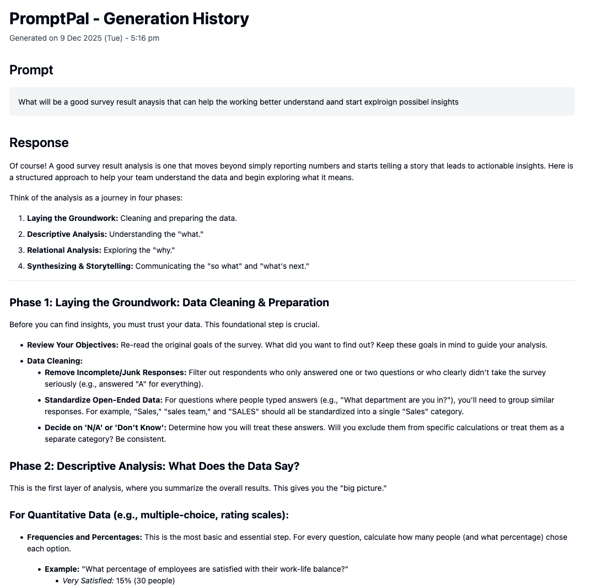
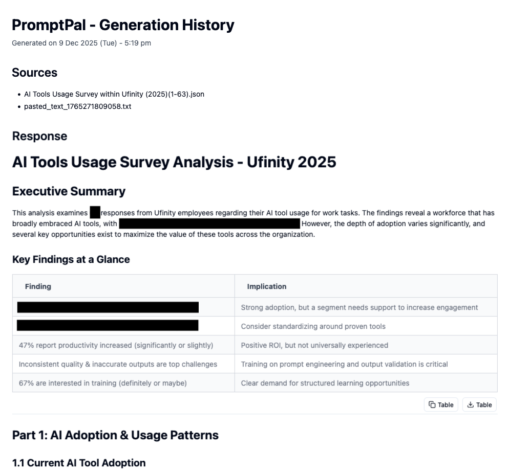
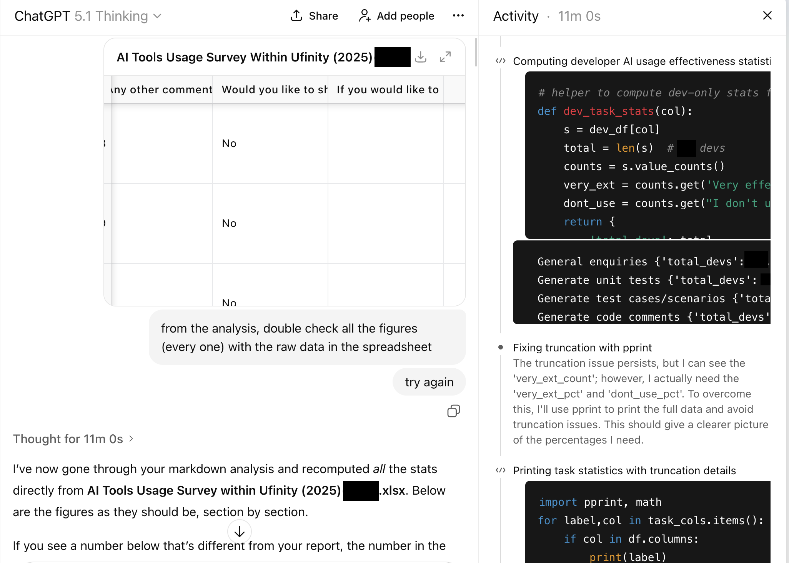
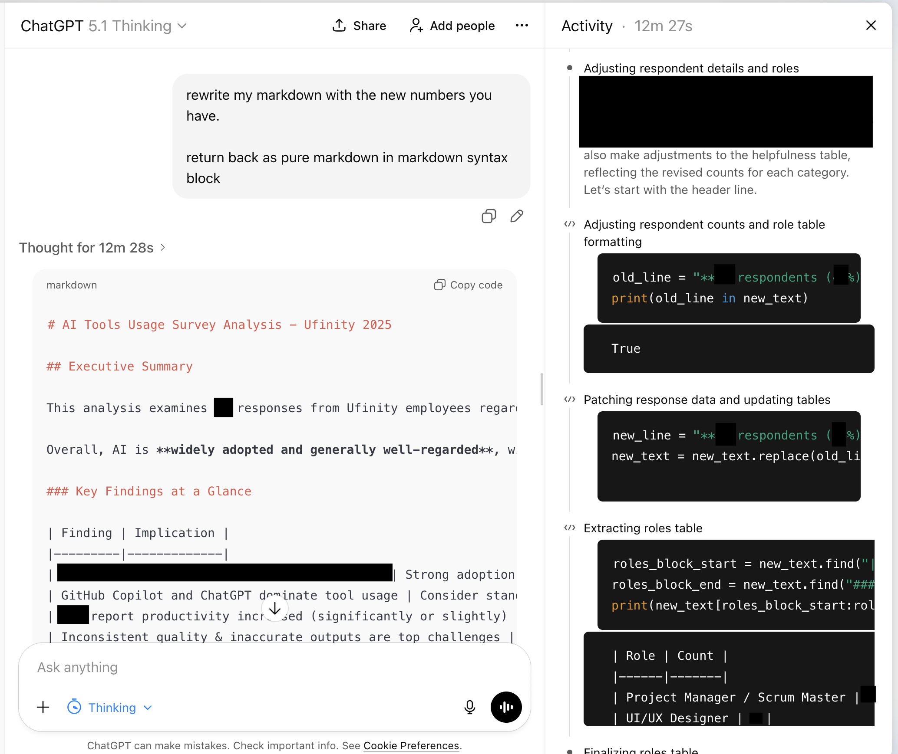

> *With the boom of AI products & startups, it's easy to lose track of what makes them unique from one another.*

Many may not know this, but different Large Language Models (LLMs) from different companies - OpenAI, Anthropic, Google - are trained on very different data. Think about it, Google has access to [14.8 billion YouTube videos](https://www.bbc.com/future/article/20250306-inside-youtubes-hidden-world-of-forgotten-videos) and petabytes of user data from Google Drive and Google Photos. No wonder their Gemini models are strong at processing PDFs and audio/video content. I guess similar dynamics apply to Anthropic, as whatever they trained Claude on likely contributed to it being good at coding.

So while different LLMs can feel interchangeable, they're not. My favourite new saying is Ted Chiang's "LLMs are a Blurry JPEG", because while these systems can compress and reconstruct patterns from their training data in new and novel ways, their strengths and blind spots can vary in ways you won't notice until you hit them, since we have no clue what they are (not) trained on.

And it's not just the models. The tooling & products around them differs too. Some AI products only generate text. Others can execute code, browse the web, or call external APIs.

So, with that, I've started exploring how to combine these tools (i.e. "tool orchestration") rather than pick one and stick with it. This month's experiment: **research survey analysis**.

---

## Why This, Why Now

Recently, I've been involved in a research effort to collect information about AI usage at my company - surveys and interviews. While making sense of the responses, I got flashbacks: climate survey data I had to crunch into spreadsheets, and before that, a past (intern) life as a data analyst wiring SQL databases into Tableau dashboards.

Data analysis may seem straightforward until you're in it. Cleaning data, categorising open-ended responses, running numbers - they are all things that can take a lot of time, especially so for very large datasets. (I'm talking about "millions of rows of data that will crash your Excel" kind of big - intern me back then was not having a good day.)

I wanted to see if I could pilot AI tools through this workflow. Not just ask one model to "analyse", but actually orchestrate different tools for different jobs.

Here's what I tried with **Gemini 2.5 Pro**, **Claude Opus 4.5**, and **ChatGPT 5.1 Thinking**.

---

## Getting a Structure First

Throwing raw data at an LLM with a prompt "analyse this" can often produces mush (or as people call it now, "AI slop"). Confident-sounding mush, but still mush.

So before touching the actual analysis, I curiously asked PromptPal (set to the **Gemini 2.5 Pro** model) on what a good survey report should contain. Just the template structure / getting started guide - no actual analysis responses yet.

> **What's PromptPal?** It's an internal AI tool I built at [Ufinity](https://www.ufinity.com) that lets Ufinity staff work with project + customer data. It's designed to be compliant with project contracts (data residency obligations) - all data stays encrypted within Singapore and is deleted from servers after use. Think of it as a internal ChatGPT that can switch between different LLM providers (OpenAI, Anthropic, Google) while keeping data handling secure.

Why Gemini? Partly because I've been hearing good things from the industry (cough, redditors) about its report-writing abilities. But I also made an educated guess: Google built Gemini. Google also has Google Drive. Google Drive is full of documents - reports, memos, analyses - uploaded by millions of users over the years. Again, it's not a stretch to assume they trained on a lot of that. If any model had seen a ton of well-structured reports, it would be Gemini.

*By the way, LLMs are quite tolerant to typos, as you can see from my ri-di-cu-lous spelling mistakes in the prompt 🤣*

It gave me four phases: Data Cleaning, Descriptive Analysis, Relational Analysis, Storytelling. I reviewed the output, and thought it was pretty good as a general guide - good for people who may have not done data crunching for research analysis.

So, with that, I started to draft out a structure for my hypothetical "insights report", and proceed with the next step.

---

## Writing the Draft

With the report structure done, I uploaded the actual data - 63 responses from colleagues in Excel - into PromptPal, and switched to **Claude Opus 4.5**.

Why Claude Opus 4.5? I've seen numerous benchmarks where it performs well on coding tasks. And there's [research floating around that links coding ability in LLMs with analytical reasoning](https://arxiv.org/html/2502.19411v1) - something about how training on code helps models think in structured, logical steps. I figured if any model had a shot at producing (cough, guessing) the right numerical percentages, it would be this one.

> Side note - if my data documents were instead in PDF or image files, I would have considered using the Gemini models instead, because of Gemini's stronger image & PDF understanding.

I gave it the data, plus my report structure, and told it to produce the report.

Tables, executive summary, recommendations. Formatted cleanly. Read professionally.

*"Hmm - maybe the new models are getting better eh? It doesn't look so mushy or sloppy after all".*

It was only when I started double-checking the numbers and percentages in the report. And that's when I noticed it.

The percentages weren't right. 🤦‍♂️

---

## But Then Again, Why Would They Be?

Okay, let's take a step back. We already know LLMs are not precise machines. They predict patterns. They don't calculate.

Even when they write really good code nowadays, [LLM agents](https://www.promptingguide.ai/research/llm-agents) still rely on a whole chain of tools to a) read context, b) check if the code actually runs, c) debug when it inevitably doesn't. There's a lot of scaffolding behind "AI wrote this working code".

[And math? LLMs are just bad at it. Their current architecture makes it hard.](https://www.reachcapital.com/resources/thought-leadership/why-llms-are-bad-at-math-and-how-they-can-be-better/) They don't have a calculator built in. They're pattern-matching on tokens, which means they are *simulating* arithmetic, not doing it. They might get it right, but you probably shouldn't bet on it.

So I needed a different tool. Still LLM-powered, but one that could actually do math.

---

## Enter the Code Interpreter

Immediately, the next tool of choice that came to mind was **ChatGPT 5.1 Thinking**.

You may be wondering why… why this tool specifically? That's because this product has something that is useful for our use case now: it has a Python code interpreter! That means, it can:

1. Read the Excel
2. Write Python code
3. Pass that code to an actual Python environment to execute it ("do the math")
4. Get the result back
5. Then use the result to inform its response.

Isn't that just great? This is also the fundamental basis of "agentic AI", or "AI with tooling". In this case, the LLM a) can access a tool, and b) will decide when to use this tool. In other words, the LLM isn't doing the math itself, instead, it's delegating to a tool that has capability to do math. That's the difference.

So, I uploaded the Excel data and the insights report generated by Claude Opus 4.5, and asked ChatGPT (set to **GPT 5.1 Thinking**) to *"double check all figures (every one) against the spreadsheet"*.

And wow, it wrote script after script after script - all just to count rows programmatically, filter out data and do sums/average/percentages. It continued doing that for a grand total of **11 minutes** ‼️

And it confirmed what I suspected - lots of numerical errors! Claude's draft said 26 non-developer respondents. The actual number: 23. Another percentage was off by four points. Small gaps (after all, the overall narrative was still accurate), but gaps that would've been factually problematic if someone downstream ran the numbers themselves.

I felt two things at once: relief that I caught it, and a small shock at how easy it was for me to have missed the mistakes during my review. The draft didn't read like something that had errors. If I was just feeling a bit lazier or tired, I may not have realised that the numerical figures were wrong.

---

## Then, Letting the Machine Fix It

I didn't want to hunt through the document correcting figures by hand. So I asked ChatGPT to take the numbers it just validated and rewrite the Markdown report.

For some reason, it decided to re-run some of the checks again (go figure, but hey, better safe than sorry), and 12 minutes and 28 seconds later, I got my revised insights report.

It kept Claude's structure and swapped in the right data. Final output: prose that read well, numbers that held up.

---

## What I'm Still Thinking About

The workflow worked - sort of. I now got a report I trusted more without manually counting cells. But I keep coming back to the thought of:

> *Ultimately, I still haven't validated the entire report by myself. So, how can I trust that the AI really got it correct without mistakes?*

LLMs are optimised to sound right. Formatting, confidence, fluency - they nail all of it. Now with AI products that have powerful tooling, they can even detect some of their own mistakes. That's exactly what makes their mistakes dangerous. They don't look like mistakes.

I don't think there's a single "best" model. **Gemini 2.5 Pro** gave me plans & structure. **Claude 4.5 Opus** gave me the narrative & numbers. **ChatGPT 5.1 Thinking** gave me verification. All of the tools come together to form a (more) believable and audited report.

But at the end of the day? The last part is still back to me, the human, the one who has to review through and validate things, especially if this was something to be submitted to others (which in my case, wasn't the task at hand for me, so yay).

That said, it reminds me of what I'm less sure about: how to build this instinct & discipline into a repeatable process. I checked this time because something felt too easy. Next time, will I remember? Or will I trust the polish and ship something broken?

That's the part I haven't "solved" yet.
